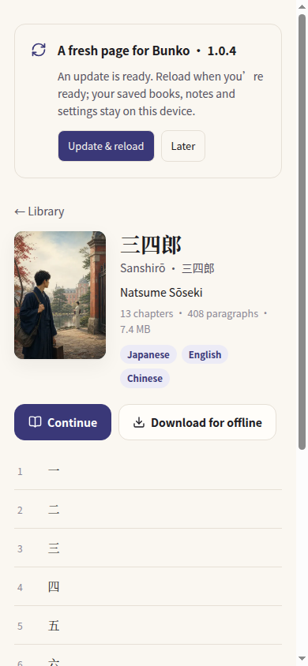

# App updates

Added 2026-09-26 in **1.0.4 (6)**. Update prompts and Settings controls are translated into English, Simplified Chinese, Traditional Chinese and Japanese.

## For readers

- Bunko checks on opening, returning to the app and reconnecting. Successful checks are limited to once every six hours; **Settings → App updates → Check for updates** checks immediately.
- A quiet card appears on the library or book page. **Later** hides that release for 24 hours; the update remains available in Settings. A different release can be offered immediately.
- The web app downloads its updated shell in the background. **Update & reload** applies it only when requested. Reloading is disabled during reading, book downloads and an unfinished book-request draft. Books, dictionary packs, saved places, notes and preferences remain on-device.
- Native iOS, Android and Mac apps compare their installed version/build with the public release record and open the appropriate store. No binary is installed from the web. Store eligibility and installation are handled by Apple or Google.
- Mac also offers **Bunko → Check for Updates…**.
- Offline or failed checks never block reading. A manual check reports the failure and can be retried. A newer TestFlight/internal build is never offered an older public release.

## Publishing a native update

`public/updates.json` is the public release feed, served by GitHub Pages at `https://lachlan.lazying.art/Bunko/updates.json`. Its URL is fixed in installed apps; retain it when moving the website. GitHub Pages supplies the cross-origin response needed by the native shells. This JSON is deliberately excluded from the service-worker precache, and requests bypass the HTTP cache.

1. Upload/test the binary and obtain store approval using the store runbook.
2. Verify that the version is **publicly available**, including its listing and the platform release/rollout status. A successful upload, TestFlight, internal testing, or approval waiting for release is insufficient.
3. Set only that platform's `version` and `build` strings in `public/updates.json`. Use `null` for a platform with no public release. Do not add a testing build to this feed. For a staged or territory-limited release, wait until the advertised rollout is available to the intended users.
4. Run `npm run check`, commit, push, wait for the Pages deployment and fetch the live JSON with caching disabled. Record the public release evidence in `store/`.

Initial verified state (2026-09-26): iOS **1.0.1 (2)**, confirmed against App Store Connect and the public Apple lookup. Android and Mac remain `null` while their production releases are in review. **The feed is updated as part of release publication; it does not scrape stores or promote internal builds automatically.**

Store destinations are compiled into the app, never accepted from feed data. Invalid feeds, failed requests and missing native build information produce a retryable check error. Version comparison is numeric and checks build numbers only when versions match.

## Web deployment and native packaging

The Vite build emits `web-release.json` with the app version and a digest of the web assets. The generated Workbox worker uses prompt mode, with neither automatic skip-waiting nor automatic client claims. The app registers it only in production web browsers. First installation does not show an upgrade card. A waiting worker receives `SKIP_WAITING` only after an explicit Update action; only that window reloads. Other open reading windows continue undisturbed.

`npm run cap:sync` uses `build:native`; this and `build:macos` exclude PWA workers. Android startup also unregisters legacy app-shell service workers and removes only their Workbox precache, fixing upgrades from 1.0.3 without clearing IndexedDB or Preferences. The migration runs in the native shell so cached old JavaScript cannot hide it. iOS/Android version information comes from Capacitor App; the Mac shell injects its signed bundle version/build. New binaries are required to enable detection in older native installations. Older web installations acquire the new prompt after their previous worker has been replaced, usually after closing and reopening all Bunko tabs.

The implementation follows the [Vite PWA prompt lifecycle](https://vite-pwa-org.netlify.app/guide/prompt-for-update) and [Capacitor App information/lifecycle API](https://capacitorjs.com/docs/apis/app).

## Verification

- Automated version, build, unpublished-platform, malformed-feed and snooze checks, plus the existing reader suite.
- Real production service worker: first installation, waiting update while reading, disabled reload, persistent dismissal, manual update, preference preservation, another open tab left running, and offline cached reading after update.
- Native Android upgrade from an existing 1.0.3 cache: migration to 1.0.4 (6), exact store link, dismissal persistence, all four interface languages and invalid-feed recovery passed. iOS/Mac packages compiled and signed; this update did not receive a physical iPhone interaction test. Native platform UI and installed build details are recorded with the release evidence. Test fixtures with a future version are used only in the private QA environment; they are never put in the public release feed.
