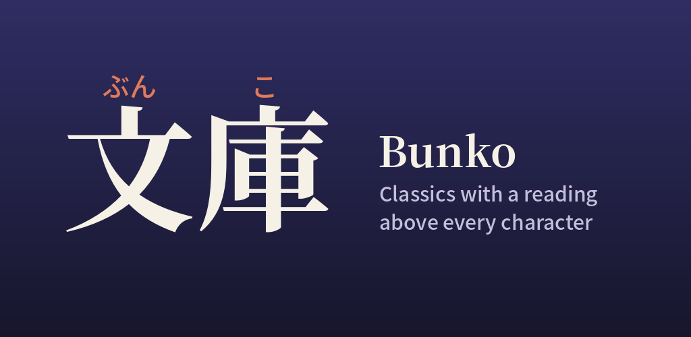

# Google Play banner correction · 8 October 2026

The owner reported that the furigana in the developer-page banner was left of
its kanji. `tools/store_assets.py` now centres each reading on its own kanji's
bounds: ぶん over 文, and こ over 庫. The existing colours, typography and copy
are preserved. The store icon exporter also uses the opaque artwork rather
than the rounded web export.

The 1024 × 500 PNG is reproducible. The only changed banner pixels are inside
the readings' rectangle `(110, 111)–(406, 146)`. Google's uploaded image was
downloaded and matched the local pixels exactly.

English uses the corrected feature graphic; the Simplified Chinese,
Traditional Chinese and Japanese forms were checked and show the same corrected
default artwork. The artwork's AI assistance declaration is retained.

Play Console confirmed **1 change sent for review**, solely **Change Feature
graphic**. Publishing overview shows **Changes in review**, with quick checks
still running at the evidence capture. Managed publishing remains off. This is
a store-artwork submission, not a new binary release; build 18 remains internal.
Approval and public propagation are not yet verified.

Asset SHA-256:
`517f5bd678e9adf5e72bbb7b68a0d72a78eb7178e5cd7edbc731756f3037c047`.
Private Console evidence: `.runtime/play-artwork-20261008/`.
