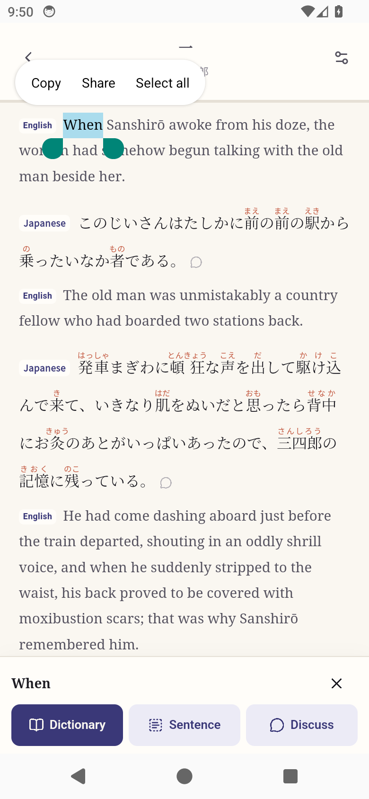
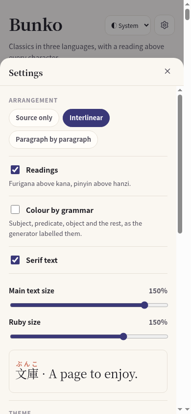
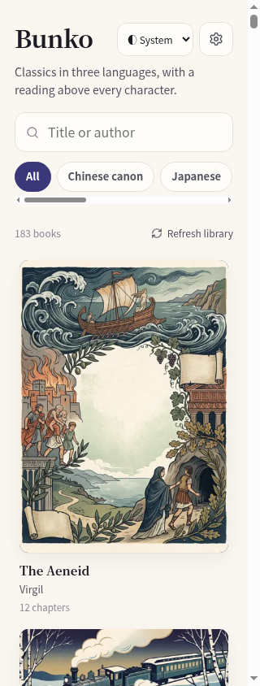

# Reading controls — 1.0.3

## Select before looking up

On a phone, long-press a word to select it. Drag the native handles to adjust the word or phrase, then choose **Dictionary** in the action bar at the bottom. On a computer, select with the mouse or double-click a word. Ordinary sentence taps never start a lookup.

**Sentence** expands the selection to its containing sentence. **Discuss** opens the discussion for the passage where the selection starts. The preview shows the text that Dictionary will receive. Ruby pronunciations, language badges and adjacent discussion buttons are excluded from the query. Keep a dictionary selection within one language layer. Use the clear button to return to reading.

## Go back

Swipe right from the left edge of the screen. A reading panel or Settings sheet closes first; from the reader you return to the book, and from the book to the library. Android's system Back follows the same order. A selection, slider drag, vertical scroll, multi-touch gesture or long hold does not navigate away. Escape supports the same back action on a keyboard.

## Set readable sizes

Settings has separate **Main text size** and **Ruby size** sliders, with a live preview and percentages. Both settings stay on the device. Existing installations receive the default ruby scale until the reader changes it. Ruby size remains fixed when main text size changes.

## Compact library header

The title, theme selector and Settings button share the top row down to a 320-pixel phone width. The subtitle sits below them.

## Verification

Thirty automated checks cover rendering, dictionary helpers, sentence boundaries, language separation, back-action priority, scrolling/selection exclusions and delayed touch events. Browser interaction checks cover the narrow header, independent persistent sizes, explicit lookup and back navigation. An Android API 34 emulator verifies native long-press handles, Sentence expansion, the selected lookup query, hardware Back, scrolling and edge swipe. WebKit verifies selection and explicit lookup. Signed Android, iOS and universal Mac packages are validated separately.

Physical iPhone long-press behavior was not tested in this update; iOS checks use WebKit plus the signed Xcode archive and Apple validation. Release and review states are recorded in [the release record](../store/release.yaml).
