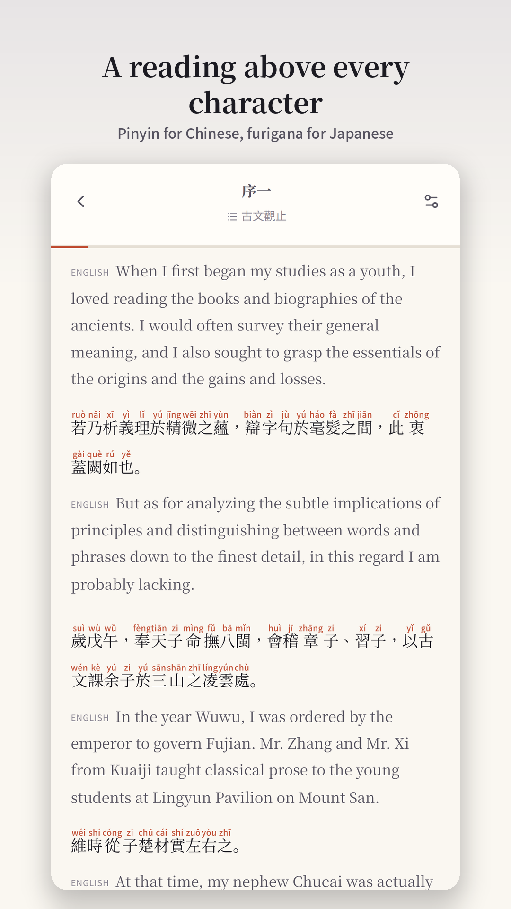

[English](../README.md) · [العربية](README.ar.md) · [Español](README.es.md) · [Français](README.fr.md) · [日本語](README.ja.md) · [한국어](README.ko.md) · [Tiếng Việt](README.vi.md) · [中文 (简体)](README.zh-Hans.md) · [中文（繁體）](README.zh-Hant.md) · [Deutsch](README.de.md) · [Русский](README.ru.md)

[](https://github.com/lachlanchen/lachlanchen/blob/main/figs/banner.png)

# Bunko 文庫

*중국어·일본어·영어 고전을 글자 위의 발음과 함께 읽는 조용한 서재.*

[](https://lachlan.lazying.art/Bunko/) [](https://github.com/sponsors/lachlanchen)

Bunko는 공개 도메인 중국어·일본어·영어 고전을 읽는 앱입니다. 표시 언어와 화면 구성을 고르고, 글자 위의 병음이나 후리가나를 보며, 다운로드한 장을 오프라인에서 읽을 수 있습니다. 인터페이스는 영어, 중국어 간체·번체, 일본어를 지원합니다. 책 목록은 별도 [bunko-books](https://github.com/lachlanchen/bunko-books)에 있으며 이 저장소에는 책 본문을 넣지 않습니다.

<p align="center"><a href="../store/assets/play-phone-01.png"></a></p>

## 저장소 구성

| 경로 | 설명 |
| --- | --- |
| [`src/`](../src/) | 리더, 루비 배치, 오프라인 캐시, 테마 설정 |
| [`docs/catalogue.md`](../docs/catalogue.md) | 권리 검토와 출판 안내 |
| [`store/`](../store/) | 스토어 상태와 운영 인계 |

## 리더 실행

의존성을 설치하고 검사를 실행한 뒤 Vite 개발 서버를 시작하세요. 네이티브 빌드는 Capacitor와 Git 외부의 비공개 서명 자료를 사용합니다.

```sh
npm ci
npm run check
npm run dev
```

## 도서관과 릴리스

공개 목록에는 확인된 판본 150종이 있습니다. 새 책은 앱을 다시 빌드하지 않고 GitHub로 게시할 수 있습니다. 리더 코드가 바뀌면 웹 또는 네이티브 새 버전이 필요합니다. 플랫폼별 공개 상태와 업데이트 심사는 아래 릴리스 기록에서 확인하세요.

[store/release.yaml](../store/release.yaml)

## Bunko 후원

Bunko는 LazyingArt 프로젝트입니다. 독서나 연구에 도움이 되었다면 지속적인 작업을 후원할 수 있습니다.

| Donate | PayPal | Stripe |
| --- | --- | --- |
| [](https://chat.lazying.art/donate) | [](https://paypal.me/RongzhouChen) | [](https://buy.stripe.com/aFadR8gIaflgfQV6T4fw400) |

## 인용

연구에 Bunko를 사용한다면 이 저장소를 인용하세요. GitHub는 [CITATION.cff](../CITATION.cff)를 읽어 인용 패널을 표시합니다.

```bibtex
@software{chen_bunko_2026,
  author = {Chen, Lachlan},
  title = {Bunko: Classics with Ruby},
  year = {2026},
  url = {https://github.com/lachlanchen/Bunko}
}
```

## 범위와 의견

AI가 생성한 학습용 번역에는 오류가 있을 수 있습니다. 목록에는 검토된 완결 판본만 게시하며 공개 도메인 기준은 지역마다 다릅니다. 리더 오류는 [Bunko issues](https://github.com/lachlanchen/Bunko/issues), 책이나 권리 문제는 [bunko-books issues](https://github.com/lachlanchen/bunko-books/issues)에 알려 주세요.
