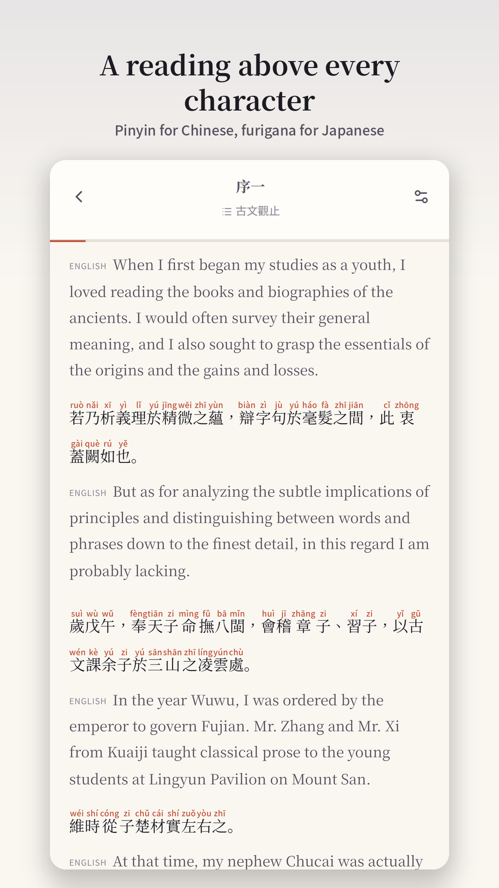

[English](../README.md) · [العربية](README.ar.md) · [Español](README.es.md) · [Français](README.fr.md) · [日本語](README.ja.md) · [한국어](README.ko.md) · [Tiếng Việt](README.vi.md) · [中文 (简体)](README.zh-Hans.md) · [中文（繁體）](README.zh-Hant.md) · [Deutsch](README.de.md) · [Русский](README.ru.md)

[](https://github.com/lachlanchen/lachlanchen/blob/main/figs/banner.png)

# Bunko 文庫

*Một thư viện yên tĩnh cho sách kinh điển ba ngôn ngữ, có cách đọc phía trên chữ.*

[](https://lachlan.lazying.art/Bunko/) [](https://github.com/sponsors/lachlanchen)

Bunko là ứng dụng đọc tác phẩm kinh điển thuộc phạm vi công cộng bằng tiếng Trung, Nhật và Anh. Bạn có thể chọn ngôn ngữ và bố cục hiển thị, xem pinyin hoặc furigana phía trên chữ, rồi đọc các chương đã tải khi ngoại tuyến. Giao diện hỗ trợ tiếng Anh, Trung giản thể, Trung phồn thể và Nhật. Danh mục sách nằm ở kho [bunko-books](https://github.com/lachlanchen/bunko-books) riêng; kho này không chứa nội dung sách.

<p align="center"><a href="../store/assets/play-phone-01.png"></a></p>

## Trong kho mã

| Đường dẫn | Mô tả |
| --- | --- |
| [`src/`](../src/) | Trình đọc, bố cục ruby, bộ nhớ ngoại tuyến và chủ đề |
| [`docs/catalogue.md`](../docs/catalogue.md) | Kiểm tra quyền và hướng dẫn xuất bản |
| [`store/`](../store/) | Trạng thái cửa hàng và bàn giao vận hành |

## Chạy trình đọc

Cài các gói phụ thuộc, chạy kiểm tra rồi mở máy chủ phát triển Vite. Bản ứng dụng gốc dùng Capacitor và thông tin ký riêng bên ngoài Git.

```sh
npm ci
npm run check
npm run dev
```

## Thư viện và bản phát hành

Danh mục trực tuyến hiện có 183 ấn bản đã được duyệt. Sách mới được xuất bản qua GitHub mà không cần tạo lại ứng dụng; thay đổi mã trình đọc vẫn cần bản web hoặc ứng dụng mới. Hồ sơ phát hành bên dưới ghi trạng thái từng nền tảng và các bản cập nhật đang xét duyệt.

[store/release.yaml](../store/release.yaml)

## Ủng hộ Bunko

Bunko là dự án LazyingArt. Nếu ứng dụng hữu ích cho việc đọc hoặc nghiên cứu, bạn có thể hỗ trợ công việc tiếp tục:

| Donate | PayPal | Stripe |
| --- | --- | --- |
| [](https://chat.lazying.art/donate) | [](https://paypal.me/RongzhouChen) | [](https://buy.stripe.com/aFadR8gIaflgfQV6T4fw400) |

## Trích dẫn

Nếu sử dụng Bunko trong nghiên cứu, hãy trích dẫn kho này. GitHub đọc [CITATION.cff](../CITATION.cff) và hiển thị bảng trích dẫn.

```bibtex
@software{chen_bunko_2026,
  author = {Chen, Lachlan},
  title = {Bunko: Classics with Ruby},
  year = {2026},
  url = {https://github.com/lachlanchen/Bunko}
}
```

## Phạm vi và phản hồi

Bản trình bày học tập do AI tạo có thể có lỗi. Danh mục chỉ xuất bản ấn bản hoàn chỉnh đã được kiểm tra; quy định phạm vi công cộng khác nhau theo lãnh thổ. Báo lỗi trình đọc tại [Bunko issues](https://github.com/lachlanchen/Bunko/issues), lỗi sách hoặc quyền tại [bunko-books issues](https://github.com/lachlanchen/bunko-books/issues).
## Đọc bằng Bunko

Thư viện hiện có 150 tác phẩm kinh điển thuộc phạm vi công cộng và 33 ấn bản được tác giả cho phép: ghi chú vật lý, sách học tập, sách tài chính và ba cẩm nang du lịch đa ngôn ngữ. Mỗi sách có thể có một hoặc nhiều ngôn ngữ; công thức và hình ảnh vẫn hiển thị trên điện thoại.

[Apple App Store](https://apps.apple.com/app/id6815137919) · [Google Play · đang chờ phát hành](https://play.google.com/store/apps/details?id=art.lazying.bunko) · [Web reader](https://lachlan.lazying.art/Bunko/)

## Bunko dành cho Mac

Phiên bản 1.0.8 (10) đã có trên Mac App Store. Ứng dụng hỗ trợ macOS 12 trở lên, với menu gốc, phím tắt và đọc ngoại tuyến. Bản dựng hỗ trợ cả Intel và Apple silicon, với kết quả thử nghiệm chạy ứng dụng trên cả hai loại máy Mac. [Mac App Store](https://apps.apple.com/us/app/bunko-classics-with-ruby/id6815137919?platform=mac)

[macOS — build & test](../docs/macos.md) · [App Store — review status](../store/macos/submission.md)

## Cập nhật ứng dụng

Bunko tự động kiểm tra bản cập nhật và hiển thị lời nhắc có thể để sau khi có bản phát hành công khai mới. Bạn cũng có thể kiểm tra thủ công trong Cài đặt. Bản web chỉ tải lại khi bạn chọn; ứng dụng gốc mở cửa hàng tương ứng. Việc đọc, tải xuống và dữ liệu đã lưu được giữ nguyên. Xem [hướng dẫn cập nhật](../docs/app-updates.md).

## Thao tác đọc

Nhấn giữ một từ, điều chỉnh tay nắm chọn văn bản rồi chọn Từ điển. Nút Câu mở rộng vùng chọn ra cả câu; chạm thông thường không mở từ điển. Vuốt sang phải từ mép trái để quay lại. Cài đặt cho phép chỉnh riêng cỡ chữ chính và chú âm ruby, kèm xem trước. Nút giao diện và Cài đặt nằm cạnh tiêu đề thư viện cả trên điện thoại hẹp.

[docs/reading-controls.md](../docs/reading-controls.md)

## Trò chuyện trong Bunko

Đăng nhập bằng GitHub để đọc và viết bình luận công khai về từng đoạn ngay trong Bunko. Bản nháp và ghi chú riêng ở lại trên thiết bị cho đến khi bạn chủ động đăng. Một dịch vụ đám mây nhỏ xử lý việc xác thực, không cần máy tính của chủ sở hữu hoạt động; GitHub lưu cuộc trò chuyện công khai. Giao diện hỗ trợ tiếng Anh, tiếng Trung giản thể, tiếng Trung phồn thể và tiếng Nhật. Phiên bản 1.0.6 (8) duy trì đăng nhập bằng bộ nhớ bảo mật và tự động làm mới mã truy cập, đồng thời khôi phục khi kết nối bị gián đoạn ngắn. iOS **1.0.8 (10)**, gồm ứng dụng đồng hành Apple Watch, đã phát hành công khai ngày 29 tháng 9 năm 2026. Mac **1.0.8 (10)** cũng đã phát hành công khai ngày 30 tháng 9 năm 2026 theo giờ Hồng Kông. Android 1.0.6 (8) tiếp tục có trong thử nghiệm nội bộ Google Play; xem hồ sơ phát hành để biết trạng thái bản chính thức.

[Triển khai và kiểm chứng tính năng thảo luận](../docs/github-discussions-2026-09-26.md).

## Mac và Apple Watch

Phiên bản **1.0.8 (10)** thêm ứng dụng đồng hành gốc cho Apple Watch và cập nhật ứng dụng Mac. Gửi trích đoạn văn bản đa ngôn ngữ từ trình đọc iPhone đến đồng hồ đã ghép đôi. Ba trích đoạn gần nhất được lưu ngoại tuyến, có chuyển đoạn và điều chỉnh cỡ chữ. Hình ảnh và công thức vẫn nằm trong trình đọc đầy đủ trên điện thoại và Mac.

Biểu tượng mới và trợ lý tài liệu riêng tư hỗ trợ PDF, Word (.docx), Markdown, văn bản và TeX, tìm bài nghiên cứu và hỏi về tài liệu. Mười kiểm tra gốc đã đạt trên Mac mini M5 Pro, gồm mở lại ngoại tuyến, vị trí đọc, công thức và hình ảnh. Trình mô phỏng Watch đã kiểm chứng truyền dữ liệu thật từ ứng dụng iPhone và khởi động lại khi ngắt kết nối; chưa kiểm tra đồng hồ thật.

[macOS](../docs/macos.md) · [watchOS](../docs/watchos.md) · [1.0.8](../store/artifacts/release-1.0.8.json)

## Bản ứng viên có quyền truy cập xét duyệt

Bản ứng viên 1.0.9 (11) bổ sung tài khoản trình diễn được ghi rõ dành cho người thử nghiệm được mời và nhân viên xét duyệt cửa hàng. Mật khẩu riêng không cần mã xác minh qua email. Bình luận và trả lời công khai là nội dung thật, có ghi tên tài khoản trình diễn; tài liệu và hội thoại chỉ được chia sẻ giữa những người dùng tài khoản đó. Đã kiểm tra việc đăng bài trên trình duyệt mới, đọc tài liệu và lưu hội thoại. Bản Apple 1.0.8 (10) đã được duyệt vẫn khả dụng; việc gửi lại sẽ xử lý đúng lý do bị từ chối.

[Quyền truy cập xét duyệt và kết quả kiểm tra](../store/reviewer-access.md)

**2026-09-30 · Bunko** — Biểu tượng xanh da trời và hồng cá hồi đã được duyệt và xuất hiện trên web. **1.0.9 (12)** có trên TestFlight (iPhone/iPad, ứng dụng đồng hành Watch và Mac) và thử nghiệm nội bộ Google Play. Hai bản cập nhật Apple đang chờ xét duyệt và sẽ tự phát hành khi được duyệt. Bản cập nhật chính thức Google và biểu tượng cửa hàng đã sẵn sàng; đợt xét duyệt hiện tại được giữ nguyên. Mọi thiết kế biểu tượng trước đây đều được lưu trữ.

**Cập nhật Watch — 1.0.9 (13):** đoạn trích đa ngôn ngữ được đối chiếu từng câu, có pinyin tiếng Trung và furigana tiếng Nhật; cỡ chữ chính và phiên âm chỉnh riêng. Đã có trên TestFlight và đã gửi bản iOS/Watch xét duyệt để tự động phát hành sau khi Apple chấp thuận. Hãy gửi lại đoạn trích cũ từ ứng dụng iPhone đã cập nhật. Đã xác minh truyền dữ liệu thật giữa hai trình mô phỏng ghép đôi và khởi động lại ngoại tuyến; chưa kiểm thử Watch vật lý. Mac và Android vẫn dùng bản dựng12 cho thử nghiệm nội bộ.
